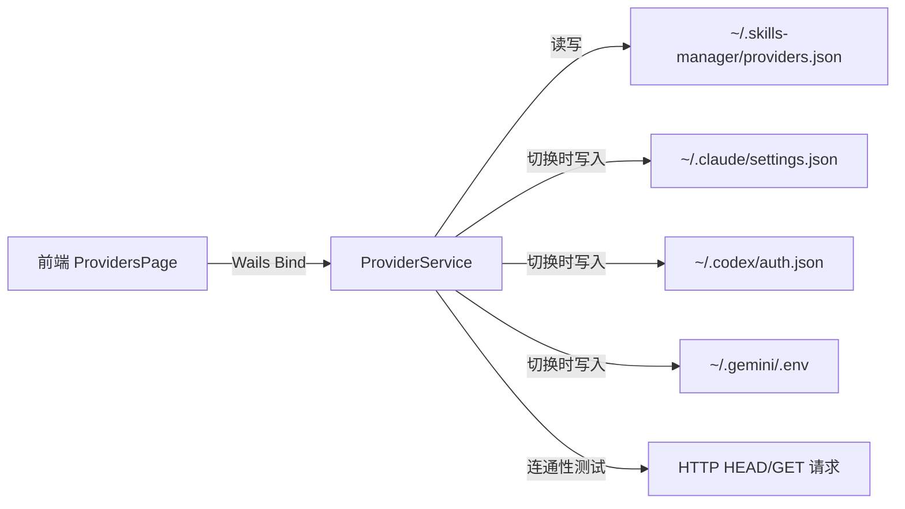
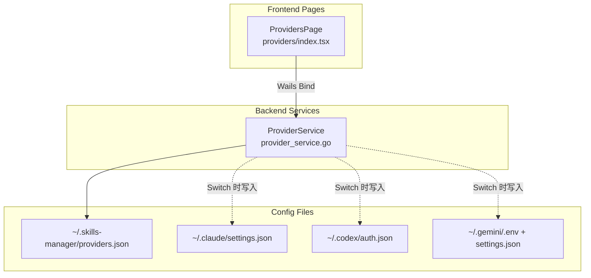

## Product Overview

在现有的 Skills Manager 桌面应用中集成类似 cc-switch 的功能模块，用于管理和一键切换 Claude Code、Codex、Gemini CLI 三种 AI Agent 的 API 供应商配置。该功能作为独立的新页面模块，与现有 Skill 管理功能并行，使用户在一个应用中同时管理 Agent 的技能和 API 配置。

## Core Features

- **供应商配置管理**：创建、编辑、删除多个 API 供应商配置，每个配置包含名称、API Key、Base URL、模型选择等完整字段
- **三应用分组管理**：按 Claude Code / Codex / Gemini CLI 三个 Tab 独立管理供应商配置，每个应用有对应的配置文件路径和字段
- Claude Code: `~/.claude/settings.json` (env 字段: ANTHROPIC_AUTH_TOKEN, ANTHROPIC_API_KEY, ANTHROPIC_BASE_URL, ANTHROPIC_DEFAULT_HAIKU_MODEL, ANTHROPIC_DEFAULT_SONNET_MODEL, ANTHROPIC_DEFAULT_OPUS_MODEL)
- Codex: `~/.codex/auth.json` + `~/.codex/config.toml` (OPENAI_API_KEY)
- Gemini CLI: `~/.gemini/.env` + `~/.gemini/settings.json` (GEMINI_API_KEY, GOOGLE_GEMINI_BASE_URL)
- **一键切换**：点击即可将选中的供应商配置写入对应 Agent 的配置文件，并显示当前激活状态
- **当前状态检测**：启动时自动读取各 Agent 配置文件，识别当前正在使用的供应商配置
- **API 连通性测试**：对 API 端点发起延迟测试，显示响应时间
- **配置导入/导出**：支持供应商配置的备份与恢复（JSON 格式）

## Tech Stack

- **后端**: Go 1.23 (与现有一致)，新增 `ProviderService` 服务
- **前端**: React + TypeScript + shadcn/ui + Tailwind CSS (与现有一致)
- **桌面框架**: Wails v2 (与现有一致)
- **配置存储**: JSON 文件存储在 `~/.skills-manager/providers.json`
- **i18n**: 复用现有 i18next 中英文方案

## Implementation Approach

采用与现有服务完全一致的分层架构：后端新增 `ProviderService` 处理供应商配置的 CRUD 和文件读写，前端新增 `/providers` 路由页面，通过 Wails 绑定调用后端方法。

**核心设计决策**：

1. **供应商配置与 Agent 配置文件解耦存储**：供应商配置集中存储在 `~/.skills-manager/providers.json`，切换时才写入目标 Agent 配置文件。这样即使 Agent 配置被外部修改也不会丢失供应商配置。
2. **配置文件读写安全**：读取/写入 Agent 配置文件时采用读-合并-写策略，只修改 env 相关字段，保留用户其他配置不变。
3. **API Key 安全**：API Key 在前端展示时做脱敏处理（仅显示前后几位），但存储时保留原文（与 cc-switch 行为一致，因为 Agent 配置文件本身也是明文存储）。

**关键数据流**：



## Implementation Notes

- **后端 ProviderService** 遵循现有服务模式：`NewProviderService()` + `Startup(ctx)` + 在 `main.go` 中注册，配置文件路径复用 `getConfigDir()` 
- **Claude Code settings.json 写入**：需要处理 JSON merge，只更新 `env` 对象内的指定 key，保留 `allowedTools` 等其他字段
- **Codex auth.json**：结构简单，直接写入 `{"token": "..."}` 格式
- **Gemini .env**：需要按行解析/写入 KEY=VALUE 格式，保留注释和其他行
- **连通性测试**：后端发起 HTTP HEAD 请求到 base URL，设置 5 秒超时，返回延迟毫秒数
- **侧边栏导航**：在 layout.tsx 的 Agents 导航项下方添加「供应商」入口，使用分隔线与其他功能区分

## Architecture Design

本功能作为独立模块嵌入现有架构，不修改任何现有服务逻辑：



## Directory Structure

```
project-root/
├── backend/services/
│   └── provider_service.go          # [NEW] 供应商配置管理服务。实现 ProviderService 结构体，包含供应商 CRUD、一键切换（写入目标 Agent 配置文件）、当前激活状态检测、API 连通性测试、导入导出等方法。数据结构包含 ProviderConfig（名称/appType/apiKey/baseUrl/models 等）。配置持久化到 ~/.skills-manager/providers.json。
├── main.go                          # [MODIFY] 注册 ProviderService：添加 providerService := services.NewProviderService()，加入 OnStartup 和 Bind 列表。
├── frontend/src/
│   ├── pages/providers/
│   │   └── index.tsx                # [NEW] 供应商管理页面。按 Claude Code / Codex / Gemini CLI 三个 Tab 分组展示供应商卡片列表，支持创建/编辑/删除供应商配置、一键切换激活、连通性测试、导入导出。使用 shadcn/ui 的 Tabs/Card/Dialog/Input/Badge/Switch 等组件，遵循现有页面的布局和交互模式。
│   ├── routes/index.tsx             # [MODIFY] 添加 /providers 路由，lazy import ProvidersPage。
│   ├── pages/layout.tsx             # [MODIFY] 在侧边栏导航中添加「供应商切换」导航项，位于 Agents 下方。添加快捷键 Cmd+6 跳转。
│   ├── i18n/zh.ts                   # [MODIFY] 添加供应商管理相关的中文翻译 key（约 40 条）。
│   └── i18n/en.ts                   # [MODIFY] 添加供应商管理相关的英文翻译 key（约 40 条）。
```

## Key Code Structures

```
// ProviderConfig 供应商配置
type ProviderConfig struct {
    ID        string            `json:"id"`
    Name      string            `json:"name"`
    AppType   string            `json:"appType"`   // "claude-code" | "codex" | "gemini-cli"
    APIKey    string            `json:"apiKey"`
    BaseURL   string            `json:"baseUrl"`
    Models    map[string]string `json:"models"`    // e.g. {"haiku":"model-name", "sonnet":"model-name", "opus":"model-name"}
    CreatedAt string            `json:"createdAt"`
    UpdatedAt string            `json:"updatedAt"`
}

// ProvidersData 供应商数据文件结构
type ProvidersData struct {
    Providers     []ProviderConfig  `json:"providers"`
    ActiveMap     map[string]string `json:"activeMap"`     // appType -> provider ID
}
```

## Design Style

延续 Skills Manager 现有的简洁精致风格，采用与现有页面完全一致的设计语言。页面使用 Tab 分组展示三种应用的供应商列表，每个供应商以卡片形式展示，激活状态用醒目的 Primary 色边框和 Badge 标识。

## Page: Providers 供应商管理页面

### Block 1: 页面标题栏

页面顶部固定区域，包含标题「供应商切换」和副标题描述，右侧放置「导入」「导出」「添加供应商」三个操作按钮。与现有 Agents 页面标题栏布局完全一致。

### Block 2: 应用 Tab 切换栏

标题下方紧接 Tabs 组件，包含「Claude Code」「Codex」「Gemini CLI」三个 Tab。每个 Tab 旁显示该应用下的供应商数量 Badge。选中 Tab 时下方显示对应供应商卡片列表。

### Block 3: 供应商卡片列表

每个供应商以水平卡片展示，左侧为应用图标和供应商名称，中间显示脱敏后的 API Key 和 Base URL，右侧显示激活状态 Badge（绿色圆点 + 「Active」）和操作按钮（切换/测试/编辑/删除）。当前激活的卡片左侧有 Primary 色竖条指示。卡片支持 hover 高亮效果。

### Block 4: 空状态与提示

当某应用下无供应商配置时，显示居中的空状态插图和「添加第一个供应商」按钮引导。底部显示对应 Agent 配置文件路径提示（如 ~/.claude/settings.json）。

### Dialog: 创建/编辑供应商

模态弹窗包含应用类型选择（如果是新增）、供应商名称、API Key（password input 可切换显示）、Base URL 输入框。Claude Code 类型额外显示 Haiku/Sonnet/Opus 模型名称输入。表单底部有取消和保存按钮。

## Agent Extensions

### Skill

- **golang-pro**
- Purpose: 编写后端 ProviderService Go 代码时，确保遵循 Go 最佳实践（错误处理、并发安全、结构体设计等）
- Expected outcome: 高质量的 Go 服务代码，包含完善的错误处理和安全的文件操作

- **react-best-practices**
- Purpose: 编写前端 ProvidersPage React 组件时，确保 hooks 使用正确、组件设计合理
- Expected outcome: 遵循 React 最佳实践的前端组件，正确使用 useEffect/useCallback/useState

- **shadcn-ui**
- Purpose: 在供应商管理页面中正确使用 shadcn/ui 组件（Tabs/Card/Dialog/Input/Badge/Switch 等）
- Expected outcome: 与现有页面风格一致的 UI 组件使用，确保组件 API 正确

- **ui-design**
- Purpose: 确保供应商管理页面的 UI 设计质量达到专业水准
- Expected outcome: 视觉精致、交互流畅的供应商管理界面

### SubAgent

- **code-explorer**
- Purpose: 在实现过程中需要搜索现有代码模式或验证 API 调用方式时使用
- Expected outcome: 准确定位现有代码中的模式和约定，确保新代码与之一致