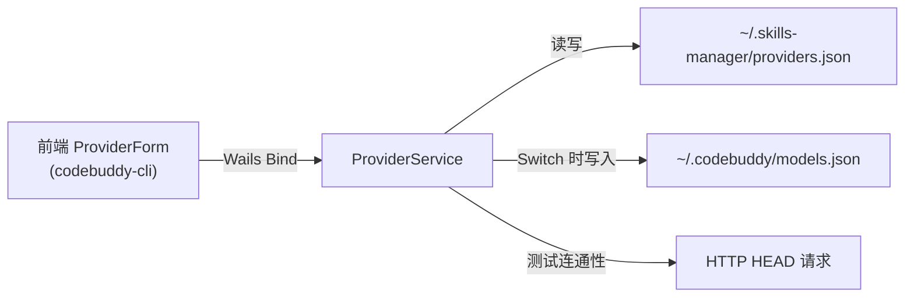

## Product Overview

在现有 Skills Manager 桌面应用的供应商切换功能中，新增第四个 AI Agent -- CodeBuddy CLI 的支持。CodeBuddy CLI 与 Claude Code/Codex/Gemini CLI 并列，作为第四个 Tab 供用户管理和一键切换 API 供应商配置。

## Core Features

- **CodeBuddy CLI Tab**：在现有三个 Tab（Claude Code / Codex / Gemini CLI）基础上新增「CodeBuddy CLI」Tab，展示和管理 CodeBuddy CLI 的供应商配置
- **CodeBuddy 配置文件读写**：读写 `~/.codebuddy/models.json`，采用读-合并-写策略，仅更新/替换对应 model ID 的条目，保留用户其他模型配置不变
- **CodeBuddy 特有表单字段**：供应商表单在 CodeBuddy CLI 模式下展示模型 ID、供应商名称（vendor）、完整 API URL（以 `/chat/completions` 结尾）、最大输入/输出 Token 数、功能开关（supportsToolCall/supportsImages/supportsReasoning）、温度参数等字段
- **CodeBuddy 配置预览**：实时预览将要写入 `models.json` 的 JSON 结构
- **CodeBuddy 预设供应商**：内置 DeepSeek、OpenRouter、Ollama 等常见 OpenAI 兼容供应商的预设
- **激活状态检测**：启动时读取 `~/.codebuddy/models.json` 匹配当前激活的供应商配置
- **连通性测试**：对 CodeBuddy 类型的供应商，测试其 API URL 的连通性

## Tech Stack

- **后端**: Go 1.23 + Wails v2（与现有一致）
- **前端**: React + TypeScript + shadcn/ui + Tailwind CSS（与现有一致）
- **配置存储**: `~/.skills-manager/providers.json`（供应商配置），`~/.codebuddy/models.json`（CodeBuddy CLI 目标配置文件）
- **i18n**: 复用现有 i18next 中英文方案

## Implementation Approach

在现有已实现的三 Agent 供应商管理功能基础上，增量添加 CodeBuddy CLI 支持。改动范围清晰且局限于已有的四个核心文件，不引入新文件或新架构模式。

**核心设计决策**：

1. **ProviderConfig 结构体复用**：CodeBuddy CLI 特有的字段（vendor、modelId、url、maxInputTokens、maxOutputTokens、supportsToolCall、supportsImages、supportsReasoning、temperature）通过 `Models map[string]string` 字段存储，与现有 Claude Code/Codex/Gemini 的模型字段存储方式一致。CodeBuddy 使用 `models["modelId"]`, `models["vendor"]`, `models["url"]`, `models["maxInputTokens"]` 等 key。这样不需要修改 Go 结构体和 Wails 自动生成的 TypeScript 类型。

2. **CodeBuddy models.json 写入策略**：读取现有 `~/.codebuddy/models.json`，找到与供应商配置中 `modelId` 相同 ID 的 model 条目进行替换，若无则追加。同时将该 model ID 加入 `availableModels` 数组。切换不同供应商时，将之前供应商的 model 从 availableModels 中移除（若不存在于其他供应商配置中）。

3. **URL 格式验证**：CodeBuddy CLI 要求 URL 必须以 `/chat/completions` 结尾，在前端表单中添加提示和校验。

4. **Bool/Number 类型通过 models map 存储为字符串**：`supportsToolCall` 存为 `"true"/"false"`，`maxInputTokens` 存为字符串数字，后端写入时解析回原始类型。

**关键数据流**：



## Implementation Notes

- **后端 `SwitchProvider` 扩展**：在 switch 分支中新增 `case "codebuddy-cli"` 调用 `writeCodeBuddyConfig()`
- **后端 `DetectActiveProviders` 扩展**：新增 `readCodeBuddyActiveModel()` 方法，读取 `~/.codebuddy/models.json` 中的第一个 model 的 apiKey 做匹配
- **后端 `TestProvider` 扩展**：CodeBuddy 类型的默认测试 URL 从 models map 中取 `url` 字段（而非 baseUrl）
- **前端 AppType 类型扩展**：`type AppType = "claude-code" | "codex" | "gemini-cli" | "codebuddy-cli"`
- **前端 APP_TYPES 数组扩展**：新增 `{ value: "codebuddy-cli", label: "CodeBuddy CLI", icon: "CB", configPath: "~/.codebuddy/models.json" }`
- **前端表单**：新增 CodeBuddy 专用字段区（modelId、vendor、url、maxTokens、功能开关），新增 CODEBUDDY_PRESETS 预设数组，新增 `codeBuddyConfigPreview` 实时预览
- **Tab 栏适配**：四个 Tab 需要从 3 列 grid 改为 4 列 grid
- **models map 约定**：CodeBuddy 使用 key: `modelId`, `vendor`, `url`, `maxInputTokens`, `maxOutputTokens`, `supportsToolCall`, `supportsImages`, `supportsReasoning`, `temperature`

## Directory Structure

```
project-root/
├── backend/services/
│   └── provider_service.go          # [MODIFY] 新增 writeCodeBuddyConfig() 方法将供应商配置写入 ~/.codebuddy/models.json；新增 readCodeBuddyActiveModel() 方法读取当前激活模型的 apiKey 做匹配；在 SwitchProvider 中增加 "codebuddy-cli" case；在 DetectActiveProviders 中增加 codebuddy-cli 检测；在 TestProvider 中增加 codebuddy-cli 默认 URL。
├── frontend/src/
│   ├── pages/providers/
│   │   └── index.tsx                # [MODIFY] AppType 类型增加 "codebuddy-cli"；APP_TYPES 数组增加 CodeBuddy CLI 条目；TabsList grid 从 3 列改 4 列。
│   ├── pages/providers/
│   │   └── form.tsx                 # [MODIFY] AppType 类型增加 "codebuddy-cli"；新增 CODEBUDDY_PRESETS 预设数组；新增 CodeBuddy 专用表单字段（modelId/vendor/url/maxTokens/功能开关/温度）；新增 codeBuddyConfigPreview；TabsList 从 3 列改 4 列；handlePresetSelect/handleSave 增加 codebuddy-cli 分支。
│   ├── i18n/zh.ts                   # [MODIFY] 添加约 15 条 CodeBuddy CLI 相关中文翻译 key。
│   └── i18n/en.ts                   # [MODIFY] 添加约 15 条 CodeBuddy CLI 相关英文翻译 key。
```

## Key Code Structures

```
// writeCodeBuddyConfig 将供应商配置写入 ~/.codebuddy/models.json
// 读取现有文件 -> 找到同 ID model 替换或追加 -> 更新 availableModels -> 写回
func (ps *ProviderService) writeCodeBuddyConfig(cfg *ProviderConfig) error

// readCodeBuddyActiveModel 读取 ~/.codebuddy/models.json 中首个 model 的 apiKey
func (ps *ProviderService) readCodeBuddyActiveModel() string
```

```typescript
// CodeBuddy models.json 写入的数据结构
interface CodeBuddyModel {
  id: string
  name: string
  vendor: string
  apiKey: string
  url: string  // 必须以 /chat/completions 结尾
  maxInputTokens?: number
  maxOutputTokens?: number
  supportsToolCall?: boolean
  supportsImages?: boolean
  supportsReasoning?: boolean
  temperature?: number
}
```

## Agent Extensions

### Skill

- **golang-pro**
- Purpose: 编写后端 writeCodeBuddyConfig / readCodeBuddyActiveModel Go 方法时，确保文件读写安全、JSON 合并逻辑正确、错误处理完善
- Expected outcome: 高质量的 Go 代码，正确读写 models.json 文件，保留用户其他配置不变

- **react-best-practices**
- Purpose: 扩展前端 form.tsx 组件时，确保新增的 CodeBuddy 表单字段 hooks 使用正确，状态管理合理
- Expected outcome: 组件不产生不必要的重渲染，表单状态正确同步

- **shadcn-ui**
- Purpose: CodeBuddy 表单中新增的 Switch/Input/Select 等组件正确使用 shadcn/ui API
- Expected outcome: 与现有表单风格完全一致的 UI 组件

### SubAgent

- **code-explorer**
- Purpose: 在实现过程中搜索现有代码中的模式和约定，确保新代码风格一致
- Expected outcome: 准确定位现有写入方法的模式并复用