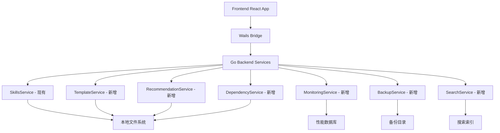

## 用户需求

用户要求为现有的 Skills Manager 应用增加以下新功能模块：

## 核心功能

### 1. 技能模板市场

- 扩展现有模板系统，增加更多内置模板（React、Vue、Python、Go、微服务、AI、数据分析等）
- 支持自定义模板上传和管理
- 模板评分和使用统计系统
- 模板分类和搜索功能

### 2. 智能推荐系统

- 基于项目文件类型自动检测并推荐相关技能
- 根据已安装技能的关联性推荐互补技能
- 基于技能使用频率的个性化推荐
- 结合社区热度数据的推荐算法

### 3. 技能依赖管理

- 技能间依赖关系的可视化图表
- 自动检测和解决技能冲突
- 依赖技能的自动安装功能
- 循环依赖检测和警告

### 4. 性能监控

- 技能使用频率统计和分析
- Agent 启动时间监控
- 技能执行耗时追踪
- 错误率统计和报告

### 5. 本地备份系统

- 技能配置的自动备份
- Agent 链接关系备份
- 用户设置和偏好备份
- 项目配置备份和恢复

### 6. 高级搜索功能

- 技能内容的全文搜索
- 按标签、语言、框架的高级筛选
- 搜索历史记录和快速访问
- 智能搜索建议和自动补全

## 技术栈选择

基于现有项目架构，继续使用：

- **后端**: Go + Wails v2
- **前端**: React 19 + TypeScript + Vite
- **UI 组件**: shadcn/ui (Radix)
- **数据存储**: 本地文件系统 + JSON
- **图表可视化**: 新增 D3.js 或 React Flow
- **搜索引擎**: 新增 Fuse.js 用于全文搜索

## 实现方案

### 系统架构设计

采用模块化扩展现有架构：



### 核心实现策略

#### 1. 模板市场实现

- 扩展现有 `SkillTemplate` 结构，增加评分、分类、作者等字段
- 创建模板仓库管理系统，支持本地和远程模板
- 实现模板评分和统计系统

#### 2. 智能推荐算法

- 项目类型检测：通过文件扩展名和配置文件分析
- 关联性分析：基于技能标签和使用模式
- 协同过滤：结合用户行为和社区数据

#### 3. 依赖管理系统

- 解析技能的 frontmatter 中的依赖声明
- 构建依赖图并检测循环依赖
- 实现依赖解析和自动安装逻辑

#### 4. 性能监控

- 在现有操作中插入性能追踪点
- 使用 Go 的 time 包记录执行时间
- 实现统计数据的聚合和分析

#### 5. 备份系统

- 定期备份关键配置文件
- 实现增量备份和版本管理
- 提供一键恢复功能

#### 6. 高级搜索

- 使用 Fuse.js 实现模糊搜索
- 建立搜索索引以提高性能
- 实现搜索历史和智能建议

## 目录结构设计

### 后端新增服务

```
backend/services/
├── skills_service.go          # 现有
├── template_service.go        # 新增：模板管理
├── recommendation_service.go  # 新增：推荐系统
├── dependency_service.go      # 新增：依赖管理
├── monitoring_service.go      # 新增：性能监控
├── backup_service.go          # 新增：备份系统
└── search_service.go          # 新增：高级搜索
```

### 前端新增页面和组件

```
frontend/src/
├── pages/
│   ├── templates/             # 新增：模板市场页面
│   ├── recommendations/       # 新增：推荐页面
│   ├── dependencies/          # 新增：依赖管理页面
│   ├── monitoring/            # 新增：性能监控页面
│   └── backup/                # 新增：备份管理页面
├── components/
│   ├── DependencyGraph/       # 新增：依赖关系图
│   ├── PerformanceChart/      # 新增：性能图表
│   ├── AdvancedSearch/        # 新增：高级搜索
│   └── RecommendationCard/    # 新增：推荐卡片
└── hooks/
    ├── useRecommendations.ts  # 新增：推荐逻辑
    ├── usePerformance.ts      # 新增：性能数据
    └── useAdvancedSearch.ts   # 新增：搜索逻辑
```

## 性能优化考虑

1. **搜索性能**: 使用索引和缓存机制
2. **依赖图渲染**: 虚拟化大型图表
3. **监控数据**: 异步收集，批量处理
4. **备份操作**: 后台执行，进度反馈
5. **推荐计算**: 缓存结果，定期更新

## 数据模型扩展

### 新增数据结构

```
// 扩展模板结构
type EnhancedSkillTemplate struct {
    SkillTemplate
    Category    string    `json:"category"`
    Author      string    `json:"author"`
    Rating      float64   `json:"rating"`
    Downloads   int       `json:"downloads"`
    Tags        []string  `json:"tags"`
    CreatedAt   time.Time `json:"createdAt"`
}

// 推荐结果
type Recommendation struct {
    SkillName   string  `json:"skillName"`
    Reason      string  `json:"reason"`
    Score       float64 `json:"score"`
    Type        string  `json:"type"` // project-based, usage-based, community
}

// 依赖关系
type SkillDependency struct {
    Name         string   `json:"name"`
    Dependencies []string `json:"dependencies"`
    Conflicts    []string `json:"conflicts"`
}

// 性能指标
type PerformanceMetric struct {
    SkillName     string        `json:"skillName"`
    UsageCount    int           `json:"usageCount"`
    AvgExecTime   time.Duration `json:"avgExecTime"`
    ErrorRate     float64       `json:"errorRate"`
    LastUsed      time.Time     `json:"lastUsed"`
}
```

## Agent Extensions

### Skill

- **react-best-practices**
- 目的：在实现前端组件时确保遵循 React 最佳实践
- 预期结果：生成高质量的 React 组件代码，包括正确的 hooks 使用和性能优化

- **golang-pro**
- 目的：实现后端 Go 服务时应用高性能编程模式
- 预期结果：生成高效的 Go 代码，包括并发处理和错误处理

- **shadcn-ui**
- 目的：确保 UI 组件与现有设计系统保持一致
- 预期结果：使用 shadcn/ui 组件库创建统一的用户界面

- **frontend-design**
- 目的：为新增功能创建美观且实用的用户界面
- 预期结果：设计出符合现代 UI 标准的界面组件

### SubAgent

- **code-explorer**
- 目的：深入探索现有代码结构，确保新功能与现有架构完美集成
- 预期结果：全面了解项目结构，找到最佳的代码集成点